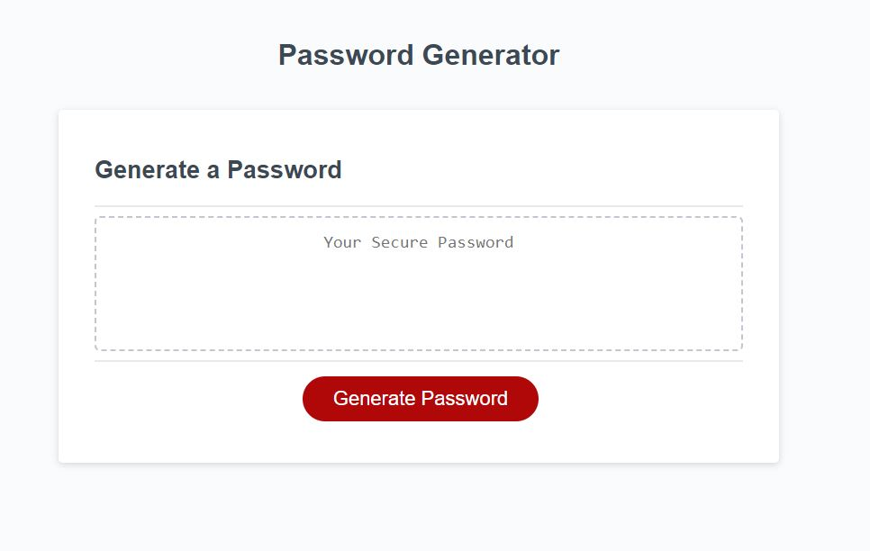

Javascript Password Generator

## Description
This application provides a randomly generated password determined by the user's input

## Installation
n/a

## Usage

To use the password generator, press generate.  Determine how long you want your password and make your selections of uppercase letters, lowercase letters, numbers, and special characters.

The password generator will provide a generated password with the selected options.

## License

This project is licensed under the MIT License.

Passgen can be found at [GitHubPages](https://aforkinthecode.github.io/passgen/)